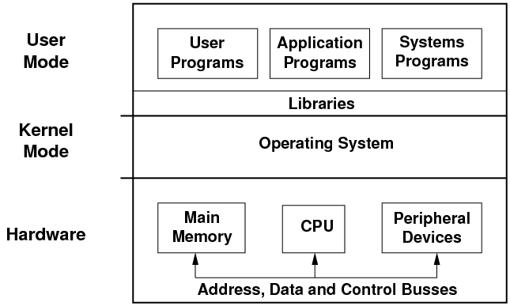

# OS Protection Boundaries

- User mode: is where applications live (unprivileged mode)
- Kernel mode: is where the OS lives and performs the systems calls to interact with the hardware
- Crossing from user to kernel mode is supported by the hardware. There is a bit enabled on CPU hardware that grants this access

- If a user mode tries to execute something that requires to be in kernel mode, it will cause a `trap`. The OS will check if the process
is granted to perform the operation.
- The interaction between the application and the system are through the `system call` interface. The OS exposes a set of operations that
are available on user mode to perform certain access such as `create`, `open` or `close` a file, create a socket `socket`, allocate memory with `mallac` and so forth.
- OS also supports `signals`, which allow the OS to interact with the process in user mode.

# System call flow chart

1. User executing a process in CPU
2. User executes a system call since needs hardware access
3. Application moves to kernel mode and executes the system call (`trap mode bit = 0`)
4. Moving from user to kernel mode generates a `context switch` (passing arguments and memory locations)
5. Once the system call is completed goes back to the `user mode` passing the return from the system call back (`return mode bit = 1`)

To make a system call an application must:

- write arguments (how many arguments to retrieve)
- save data at well defined locations (memory/disk)
- make a system call
- arguments can be passed through the application via `variables` or indirectly using their address.

NOTE: in sychronous mode the `process` will wait until the `system call` is completed.

# Crossing the OS boundaries

- Hardware supports traps
- traps on illegal instructions or memory accesses require special privileges
- Transition from user to kernel mode has an overhead of about `50ns` to `100ns` on a 2GHZ machine running Linux.
- Transitioning from `user` to `kernel` mode affects hardware/CPU `caches`
  - During a context switch the process needs to bring the content for the new process in memory and this will wipe out the previous `cached` content.

# Basic OS Services

- Scheduler: CPU
- Memory Manager: Memory (RAM)
- Block device driver: File systems
- Process Control: Create process
- File manipulation: Create a file, read a file, etc.

Comparisson chart of system calls in Windows and Linux systems can be found [here](https://s3.amazonaws.com/content.udacity-data.com/courses/ud923/notes/ud923-p1l2-windows-vs-linux-system-calls.png)

# Monolithic kernel

- All the components are part of the operating systems (kernel modules for things you don't need or have)
  - Everything is include
- Cons:
  - Performance (memory footprint)
  - Portability

# Modular Kernel

- Easy to load new functionality (modules)
- less resource intensive (loads just basic modules to guarantee it works out of the box)
- small footprint
- cons:
  - external modules can contain bugs
  - maintenance can be problematic

# Micro Kernel

- IPC (inter process communication) is the base of micro kernels to keep all processes running in user mode communicated
- In kernel mode you only need `memory management`, `threads`, `CPU`. File system , Disk driver and other applications run in `user` mode.
- Micro kernels are very small (embedded devices)
- Cons:
  - Portability
  - Cost of user/kernel context switching

# References

- https://www.cs.uic.edu/~jbell/CourseNotes/OperatingSystems/1_Introduction.html
- https://minnie.tuhs.org/CompArch/Lectures/week07.html
